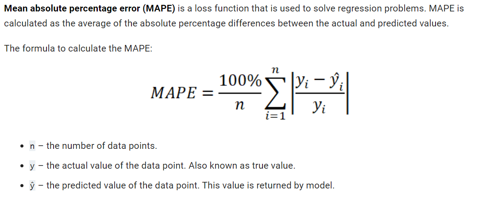

# Temporal forecasting of temperature and Carbon Monoxide CO sensor data one day ahead
## IEEE Sensors Council Young Professionals Hackathon 2021- The Blue Sky Challenge
## THEME: Forecasting sensor measurements in smart air quality monitoring system

### Background
Air quality has a significant impact on the overall well-being of humans and society across the globe. The rewards of good air quality are numerous, including substantial health, environmental, and economic benefits.  However, as a result of increasing urbanisation and industrialisation, air quality in major cities around the world is becoming a source of concern. Several nations have made efforts to implement smart city initiatives, in which sensors play a vital role in informing both governing authorities and the general public about real-time air quality levels via mobile or web-based apps.  Traditional sensor monitoring can be made smarter through the adoption of state-of-the-art machine learning algorithms, which will allow for an improvement in the current capabilities of air quality monitoring. In this context, the sub-theme 2 of the hackathon seeks to discover new innovative solutions for developing smart air quality monitoring systems by integrating sensor technology with machine learning algorithms.

### Problem statement
A number of factors in the air can have an impact on its quality. Multiple sensors monitoring various parameters are used in air quality monitoring sensing systems, which are available as a whole suite. The role of temperature  and carbon monoxide in air quality is vital. This issue is tackled by Temporal forecasting of temperature and Carbon Monoxide (CO) sensor data one day ahead: It can assist the general public and government officials in anticipating trends early in order to make timely decisions and take preventative actions.
Advanced machine learning algorithms combined with sensor data have the potential to be a leap forward and in addressing the problem listed above. Therefore, the primary emphasis of this sub-theme 2 is on the development of machine learning algorithm to solve the defined problem. To evaluate the developed machine learning algorithm, the participants can use the dataset from the air quality chemical multisensory device deployed in the field in an Italian city.

## Approach
For univariate forecasting, there are many possibilities such as LSTM (Long Short-Term Memory), Autoregressive integrated moving average(ARIMA), Seasonal Autoregressive integrated moving average (SARIMA) etc. Given data has very short training period (7-13 days) and by looking at our data, we can see there is huge change in Temperature after 18th of March. LSTM will not be a good idea because of limitation in training period and ARIMA model does not takes into account seasonality and we can see there is seasonality of 24 hours in our dataset. Our data also consits of lot of noises so best option will be Seasonal Auto-Regressive Integrated Moving Average with eXogenous factors,which also takes noise factor into account. SARIMAX will reduces error more on test data as compared to other model.
- Accurate and powerful model(optimized) for short training time
- Includes seasonality, trend and noise in model
- It includes exogenous factors (noises) as there is lot of noise in dataset from 18th March to 24th March 2004
- Seasonality as local trend in dataset repeats every 24 hours
- Hyperparameter tuning using AIC (Akaike's Information Criteria) and BIC (Bayesian Information Criteria)

### Performance analysis

